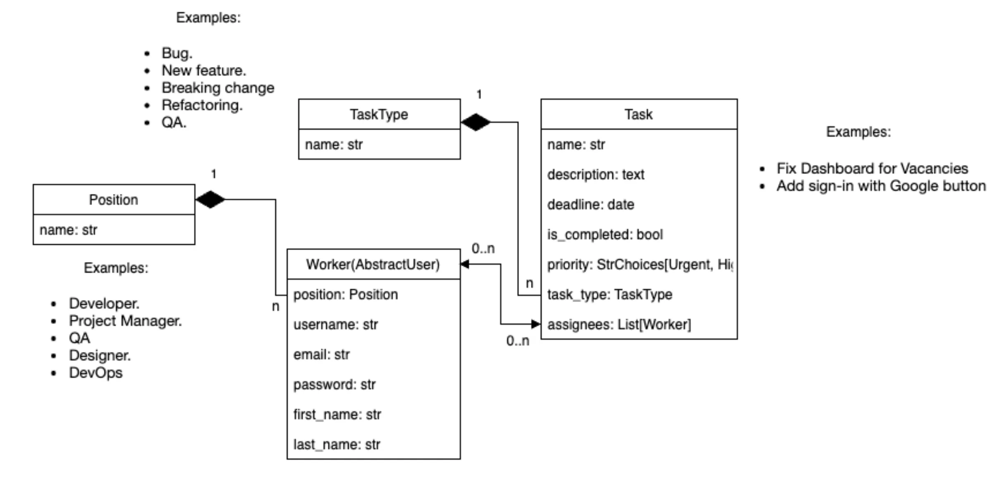
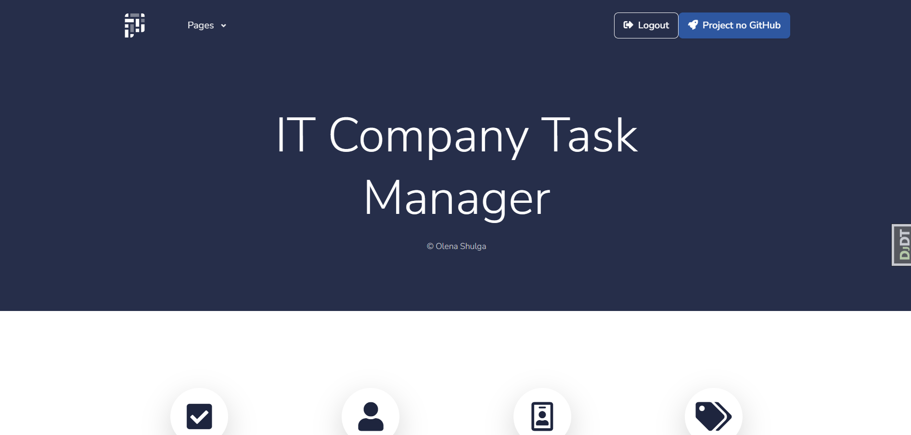
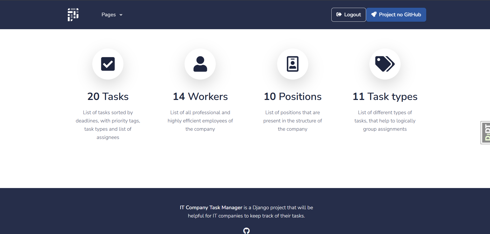
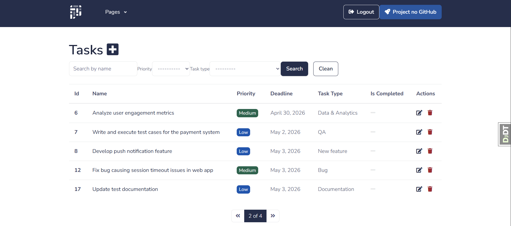
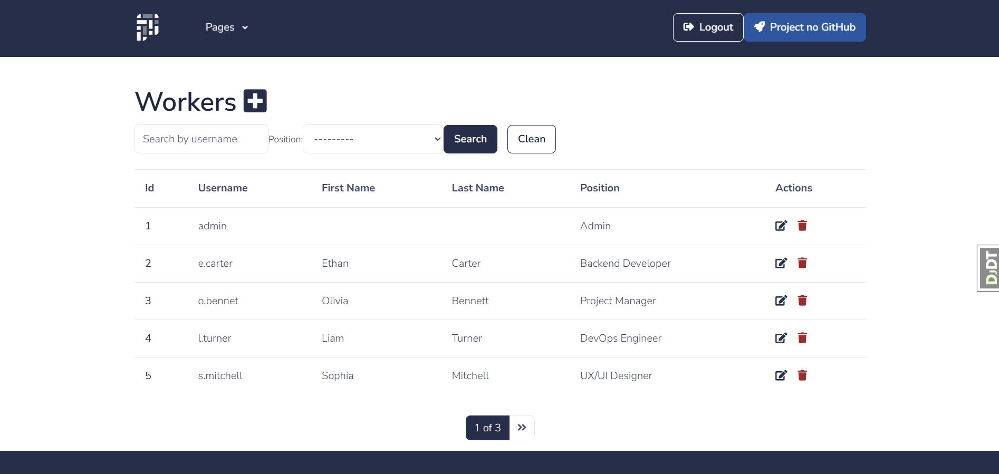
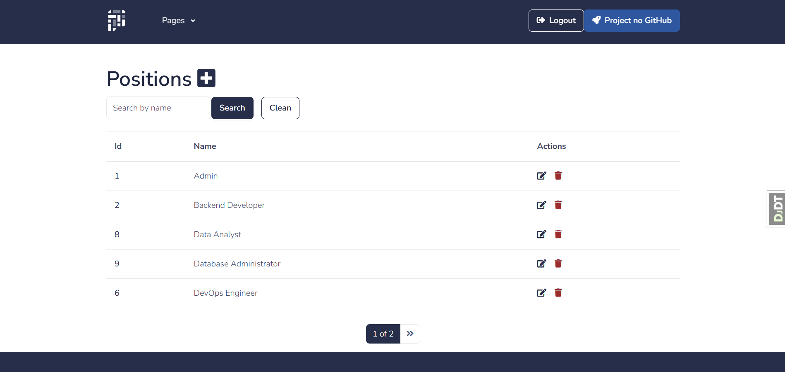
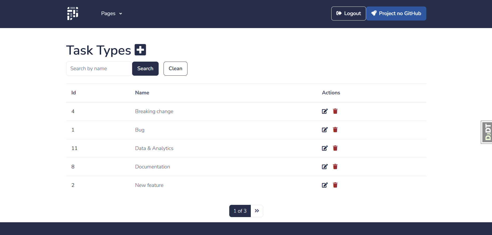
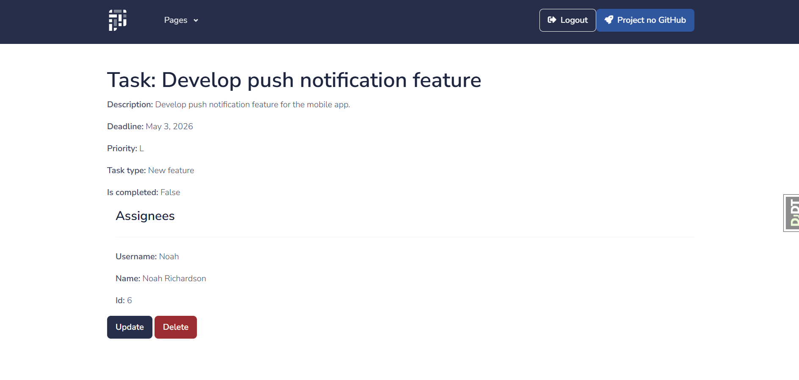

# It Company Task Manager
New features implemented:
- For each worker it is shown separately: completed and not completed tasks.

**DB Structure:**

Page images:
1. Home page

2. List of tasks

3. List of workers

4. List of positions

5. List of task types

6. Details of a task

7. Details of a worker

